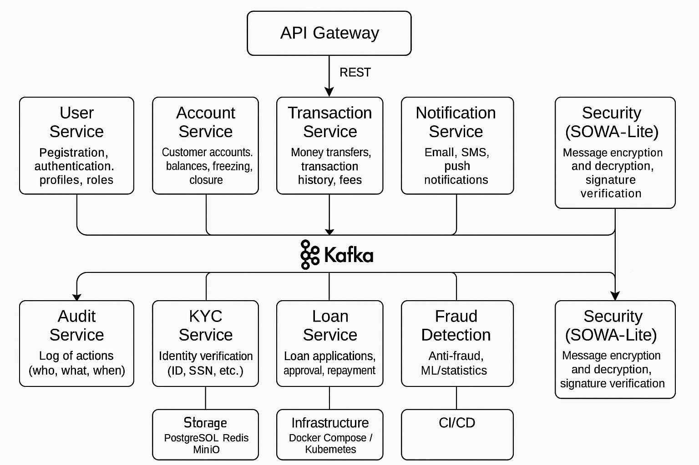

# 🏦 Bank App

Банковская система, построенная на Java 21 с использованием Spring Boot и Clean Architecture. Разрабатывается в рамках учебного проекта.

## 📚 Описание

Проект моделирует основные операции банковской системы:
- Управление пользователями и счетами
- Переводы между счетами
- Ведение истории транзакций
- Безопасность через JWT
- Построение микросервисной архитектуры (в будущем)

## 🔧 Технологии

- Java 21
- Spring Boot
- Spring Security
- Spring Data JPA
- PostgreSQL
- Gradle
- Docker (в перспективе)
- Clean Architecture

## 🏗️ Архитектура проекта

Архитектура следует принципам Clean Architecture:
- Domain — бизнес-логика и сущности
- Application — DTO, use cases, сервисы
- Infrastructure — безопасность, репозитории, конфиги
- Presentation — контроллеры

## 📂 Модули (будущие микросервисы)

- User Service (:8083)
- Account Service ()
- Transaction Service ()
- Notification Service ()
- Audit Service ()
- KYC Service ()
- Loan Service ()
- Fraud Detection ()
- Security (SOWA-lite) (:8085)
- API Gateway ()


## 🏦 KYC Service

Сервис KYC (Know Your Customer) отвечает за верификацию клиентов банка и проверку документов.

### 📚 Описание

KYC Service позволяет:
- Инициировать KYC-заявку для пользователя
- Загружать документы (паспорт, utility bill и др.)
- Проверять статус заявки
- Уведомлять другие микросервисы через Kafka

### 🔧 Технологии

- Java 21, Spring Boot
- Spring Data JPA, PostgreSQL
- Spring Kafka (producer/consumer)
- MinIO (хранилище документов)
- Docker
- Clean Architecture

### 🏗 Архитектура

- Presentation — REST-контроллеры (KycServiceController)
- Application — сервисы (KycRequestService), DTO, мапперы
- Domain — сущности KycRequest, KycDocument
- Infrastructure — репозитории, MinIO, Kafka

Диаграмма компонентов:
User -> REST Controller -> Service -> Repository / MinIO
-> Kafka Producer -> Kafka Topic (kyc-events)

### 🧭 API

| Метод | URL                       | Описание                        | Ответ          |
|-------|---------------------------|--------------------------------|----------------|
| POST  | /kyc/start                | Создание заявки KYC для userId  | KycRequestDTO  |
| GET   | /kyc/{userId}             | Получение статуса KYC           | KycRequestDTO  |
| POST  | /kyc/{userId}/documents   | Загрузка документа              | 202 Accepted   |

Swagger: [http://localhost:8080/swagger-ui.html]

### 📈 Бизнес-процесс KYC

1. Создание заявки: POST /kyc/start?userId=123 → статус PENDING
2. Загрузка документа: POST /kyc/{userId}/documents → документ в MinIO, событие в Kafka
3. Проверка документов: статус меняется на APPROVED или REJECTED
4. Получение статуса: GET /kyc/{userId} → KycRequestDTO

### 🔄 Статусы KYC

| Статус     | Описание                             | Возможные переходы          |
|------------|-------------------------------------|-----------------------------|
| PENDING    | Заявка создана, документы не загружены | → APPROVED, → REJECTED   |
| APPROVED   | KYC успешно пройден                   | —                           |
| REJECTED   | KYC отклонён                         | → PENDING (повторная попытка) |

### 🚀 Локальный запуск KYC Service

1. Настроить .env или application-test.yml с БД, Kafka и MinIO
2. Собрать сервис:
   ```bash
   ./gradlew clean build
3. Запуск через Gradle:

./gradlew bootRun

4. Или через Docker:

docker-compose build
docker-compose up

5. Доступ к Swagger:
   http://localhost:8080/swagger-ui.html


## Статический анализ кода
Проект использует SpotBugs для статического анализа кода.
### Запуск анализатора
Для ручного запуска:
bash:
./gradlew spotbugsMain

## Health Check Endpoints

- `/actuator/health` — общее состояние сервиса
- `/actuator/health/liveness` — сервис жив
- `/actuator/health/readiness` — сервис готов к обслуживанию

# Аспект аудита
### Описание
Аспект автоматически фиксирует события для критических бизнес-операций.

### Поддерживаемые действия
- CREATE_ACCOUNT
- CHANGE_PASSWORD

### Как использовать
Добавьте аннотацию `@Auditable(action = "...")` к нужному методу.

### Формат события
```json
{
  "action": "Регистрация аккаунта",
  "timestamp": "2025-06-27T16:00:00",
  "username": "user@example.com",
  "parameters": "param1, 123",
  "status": "SUCCESS"
}

## 🧭 Архитектура микросервисов




🌉 API Gateway — это единая точка входа во все микросервисы банковской системы.
🔧 Возможности:
Проксирование HTTP-запросов ко всем микросервисам через централизованные маршруты
Проброс всех заголовков (в том числе Authorization)
Базовая конфигурация CORS для поддержки кросс-доменных запросов
Логирование всех проксируемых маршрутов в консоль
Лёгкое добавление новых маршрутов через application.yml
Отдельный порт (по умолчанию: 8765)


🚀 Как запустить API Gateway:
Автоматически через docker compose


⚙️ Как добавить новый маршрут:
Открой файл:
api-gateway/src/main/resources/application.yml


Добавь новый блок для своего сервиса по шаблону:
spring:
  cloud:
    gateway:
      routes:
        - id: your-service-name
          uri: http://localhost:808X
          predicates:
            - Path=/api/your-service/**
          filters:
            - StripPrefix=2
Перезапусти Gateway для применения изменений.


🔒 CORS и безопасность:
🌐 CORS Policy

Наше API использует CORS для контроля доступа с фронтенда.
Все preflight-запросы (OPTIONS) корректно обрабатываются.

✅ Разрешённые Origins
Окружение  Разрешённые домены
Development (dev)  http://localhost:3000, http://localhost:8080, http://localhost:8081
Production (prod)  Доверенные фронтенд-домены, например: https://frontend1.example.com, https://frontend2.example.com (настраиваются через application-prod.yml или переменные окружения CORS_ALLOWED_ORIGINS)
🔹 Разрешённые HTTP методы

      GET
      POST
      PUT
      DELETE
      OPTIONS (для preflight-запросов)

🔹 Разрешённые заголовки

      Authorization
      Content-Type

🔹 Credentials

      Allow-Credentials: true — браузер может отправлять cookie и заголовки авторизации
       вместе с запросами.

⚡️ Preflight (OPTIONS) Requests

Все preflight-запросы автоматически разрешены для указанных методов и заголовков.

Примеры

GET запрос на пользователя

curl -i -X OPTIONS http://localhost:8765/api/users/1 \
  -H "Origin: http://localhost:3000" \
  -H "Access-Control-Request-Method: GET" \
  -H "Access-Control-Request-Headers: Authorization, Content-Type"


POST запрос на регистрацию

curl -i -X OPTIONS http://localhost:8765/api/users/register \
  -H "Origin: http://localhost:3000" \
  -H "Access-Control-Request-Method: POST" \
  -H "Access-Control-Request-Headers: Authorization, Content-Type"


POST запрос на проверку безопасности

curl -i -X OPTIONS http://localhost:8765/api/security/verify \
  -H "Origin: http://localhost:3000" \
  -H "Access-Control-Request-Method: POST" \
  -H "Access-Control-Request-Headers: Authorization, Content-Type"


GET/DELETE запрос к аккаунту

curl -i -X OPTIONS http://localhost:8765/api/accounts/1 \
  -H "Origin: http://localhost:3000" \
  -H "Access-Control-Request-Method: GET" \
  -H "Access-Control-Request-Headers: Authorization, Content-Type"

curl -i -X OPTIONS http://localhost:8765/api/accounts/1 \
  -H "Origin: http://localhost:3000" \
  -H "Access-Control-Request-Method: DELETE" \
  -H "Access-Control-Request-Headers: Authorization, Content-Type"

Ожидаемый ответ для всех OPTIONS-запросов
HTTP/1.1 200 OK
Access-Control-Allow-Origin: http://localhost:3000
Access-Control-Allow-Methods: GET,POST,PUT,DELETE,OPTIONS
Access-Control-Allow-Headers: Authorization, Content-Type
Access-Control-Allow-Credentials: true
Access-Control-Max-Age: 3600

⚙️ Переключение между Dev и Prod

Dev (application.yml): разрешены локальные порты (localhost:3000, localhost:8080, …).

Prod (application-prod.yml): разрешены только доверенные фронтенд-домены.


## 📚 Wiki-руководства


- [Взаимодействие между слоями](https://gitlab.com/katacademy-group/banking-projects/bank-app/-/wikis/layer-module-communication)

- [Кодстайл](https://gitlab.com/katacademy-group/banking-projects/bank-app/-/wikis/code-style-guide)

- [Подготовка к клонированию репозитория](https://gitlab.com/katacademy-group/banking-projects/bank-app/-/wikis/setup-before-cloning)

и другие руководства

## 🚀 Как запустить

```bash
/gradlew clean build
docker compose build
docker compose up
